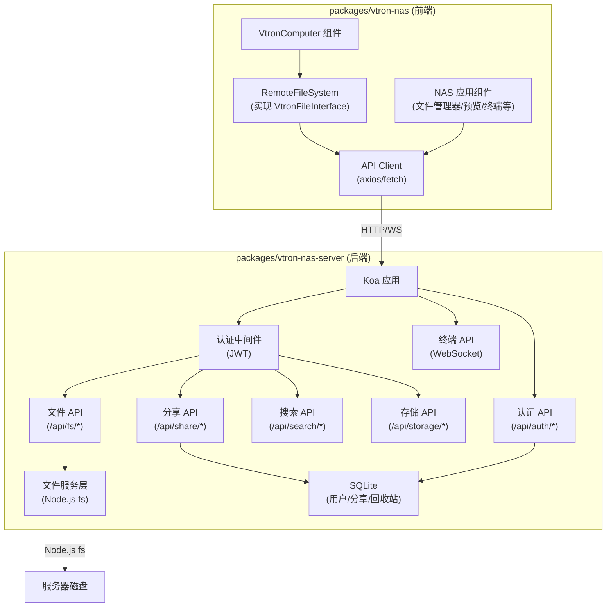
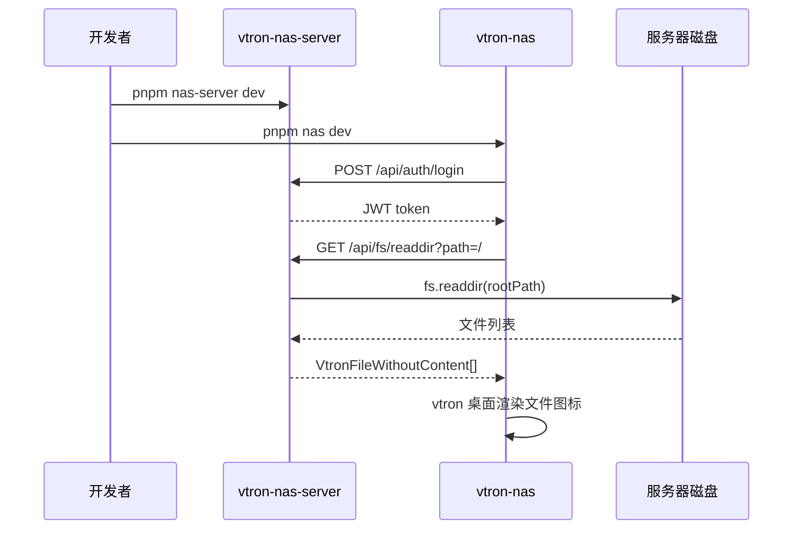

# Vtron NAS 系统实施计划

## 整体架构



## 一、后端 `packages/vtron-nas-server`

### 技术栈
- **Koa 2** + koa-router + koa-body（文件上传用 formidable）
- **JWT** 认证（jsonwebtoken + koa-jwt）
- **better-sqlite3** 轻量数据库（用户、分享链接、回收站记录）
- **node-pty** + ws（WebSocket 终端）
- **chokidar** 文件变更监听（可选，用于 watcher 推送）
- **TypeScript** 编写

### API 设计

#### 1. 认证模块 `/api/auth`

| 方法 | 路径 | 说明 |
|------|------|------|
| POST | `/api/auth/login` | 登录，返回 JWT |
| POST | `/api/auth/register` | 注册（管理员可创建用户） |
| GET  | `/api/auth/me` | 获取当前用户信息 |
| PUT  | `/api/auth/password` | 修改密码 |

#### 2. 文件系统模块 `/api/fs` -- 对齐 VtronFileInterface

| 方法 | 路径 | 对应 VtronFileInterface 方法 |
|------|------|------|
| GET | `/api/fs/readFile?path=` | `readFile(path)` |
| POST | `/api/fs/writeFile` | `writeFile(path, data, opt)` |
| POST | `/api/fs/appendFile` | `appendFile(path, content)` |
| GET | `/api/fs/readdir?path=` | `readdir(path)` |
| GET | `/api/fs/exists?path=` | `exists(path)` |
| GET | `/api/fs/stat?path=` | `stat(path)` |
| DELETE | `/api/fs/unlink?path=` | `unlink(path)` -- 移入回收站 |
| PUT | `/api/fs/rename` | `rename(oldPath, newPath)` |
| DELETE | `/api/fs/rm?path=` | `rm(path)` -- 移入回收站 |
| DELETE | `/api/fs/rmdir?path=` | `rmdir(path)` -- 移入回收站 |
| POST | `/api/fs/mkdir` | `mkdir(path)` |
| POST | `/api/fs/copyFile` | `copyFile(src, dest)` |
| PUT | `/api/fs/chmod` | `chmod(path, mode)` |
| GET | `/api/fs/search?keyword=` | `search(keyword)` |
| POST | `/api/fs/upload` | 二进制文件上传（multipart） |
| GET | `/api/fs/download?path=` | 二进制文件下载（stream） |
| GET | `/api/fs/preview?path=` | 文件预览（图片/视频/音频 stream） |

#### 3. 回收站模块 `/api/trash`

| 方法 | 路径 | 说明 |
|------|------|------|
| GET | `/api/trash/list` | 列出回收站内容 |
| POST | `/api/trash/restore` | 恢复文件 |
| DELETE | `/api/trash/purge` | 彻底删除 |
| DELETE | `/api/trash/empty` | 清空回收站 |

#### 4. 分享模块 `/api/share`

| 方法 | 路径 | 说明 |
|------|------|------|
| POST | `/api/share/create` | 创建分享链接（可设密码和过期时间） |
| GET | `/api/share/:token` | 通过分享令牌访问 |
| GET | `/api/share/:token/download` | 通过分享令牌下载 |
| DELETE | `/api/share/:id` | 取消分享 |
| GET | `/api/share/list` | 列出我的分享 |

#### 5. 存储信息 `/api/storage`

| 方法 | 路径 | 说明 |
|------|------|------|
| GET | `/api/storage/info` | 磁盘总量/已用/可用 |
| GET | `/api/storage/usage?path=` | 指定目录大小 |

#### 6. 终端 WebSocket `/ws/terminal`

- 使用 `ws` 库建立 WebSocket 连接
- 后端通过 `node-pty` 创建伪终端进程
- 前端用 xterm.js 渲染（vtron-plus 已有 xterm 依赖）

### 目录结构

```
packages/vtron-nas-server/
  ├── package.json
  ├── tsconfig.json
  ├── src/
  │   ├── index.ts                 # 入口，启动 Koa
  │   ├── config.ts                # 配置（端口、存储根路径、JWT密钥等）
  │   ├── app.ts                   # Koa 实例与中间件组装
  │   ├── middleware/
  │   │   ├── auth.ts              # JWT 认证中间件
  │   │   ├── errorHandler.ts      # 统一错误处理
  │   │   └── logger.ts            # 请求日志
  │   ├── routes/
  │   │   ├── auth.ts              # 认证路由
  │   │   ├── fs.ts                # 文件系统路由
  │   │   ├── trash.ts             # 回收站路由
  │   │   ├── share.ts             # 分享路由
  │   │   ├── storage.ts           # 存储信息路由
  │   │   └── index.ts             # 路由聚合
  │   ├── services/
  │   │   ├── fileService.ts       # 文件操作服务（封装 Node.js fs）
  │   │   ├── authService.ts       # 用户认证服务
  │   │   ├── trashService.ts      # 回收站服务
  │   │   ├── shareService.ts      # 分享服务
  │   │   ├── storageService.ts    # 存储信息服务
  │   │   └── terminalService.ts   # WebSocket 终端服务
  │   ├── db/
  │   │   ├── database.ts          # SQLite 初始化
  │   │   └── migrations.ts        # 表结构定义
  │   └── utils/
  │       ├── pathSecurity.ts      # 路径安全校验（防目录穿越）
  │       └── fileHelper.ts        # 文件工具函数
```

### 安全要点
- **路径安全**：所有文件路径参数必须经过 `path.resolve` + 前缀校验，防止 `../` 目录穿越
- **JWT 令牌**：所有 `/api/fs`、`/api/share`（管理）、`/api/trash`、`/api/storage` 需携带 token
- **分享令牌**：公开访问分享内容时仅需分享 token，不需要用户 JWT
- **文件大小限制**：上传配置最大文件大小

---

## 二、前端 `packages/vtron-nas`

### 技术栈
- **Vue 3** + vtron（从 workspace 引用）
- **Vite** 构建
- **axios** 作为 HTTP 客户端

### 核心：`RemoteFileSystem` -- 实现 VtronFileInterface

这是前后端桥梁的关键。参考 [FIleInterface.ts](packages/vtron/src/packages/kernel/file/FIleInterface.ts) 的接口定义，创建 `RemoteFileSystem` 类：

```typescript
class RemoteFileSystem implements VtronFileInterface {
  readonly name = 'RemoteFS';
  isFirstRun = false;

  // 每个方法内部调用后端对应 API
  async readFile(path: string): Promise<string | null> {
    const res = await api.get('/api/fs/readFile', { params: { path } });
    return res.data.content;
  }

  async readdir(path: string): Promise<VtronFileWithoutContent[]> {
    const res = await api.get('/api/fs/readdir', { params: { path } });
    return res.data.files;
  }
  // ... 其余方法类似
}
```

通过 `new System({ fs: new RemoteFileSystem(baseURL, token) })` 传入，vtron 所有文件操作即自动走后端。

### NAS 专属应用组件

| 组件 | 功能 |
|------|------|
| `FileManager.vue` | 文件管理器（上传/下载按钮、拖拽上传、右键菜单增强） |
| `FilePreview.vue` | 文件预览器（图片/视频/音频/PDF/文本） |
| `ShareManager.vue` | 分享管理（创建/查看/取消分享） |
| `TrashBin.vue` | 回收站（恢复/彻底删除/清空） |
| `StorageInfo.vue` | 存储空间信息仪表盘 |
| `Terminal.vue` | Web 终端（xterm.js + WebSocket） |
| `LoginPage.vue` | 登录页面 |
| `UserSettings.vue` | 用户设置（改密码等） |

### 目录结构

```
packages/vtron-nas/
  ├── package.json
  ├── tsconfig.json
  ├── vite.config.ts
  ├── index.html
  ├── src/
  │   ├── main.ts                      # 入口
  │   ├── App.vue                      # 根组件，初始化 System
  │   ├── fs/
  │   │   └── RemoteFileSystem.ts      # VtronFileInterface 远程实现
  │   ├── api/
  │   │   ├── client.ts                # axios 实例（baseURL、拦截器、token）
  │   │   ├── auth.ts                  # 认证 API 封装
  │   │   ├── fs.ts                    # 文件 API 封装
  │   │   ├── share.ts                 # 分享 API 封装
  │   │   ├── trash.ts                 # 回收站 API 封装
  │   │   └── storage.ts               # 存储 API 封装
  │   ├── apps/
  │   │   ├── FileManager.vue          # 文件管理器
  │   │   ├── FilePreview.vue          # 文件预览
  │   │   ├── ShareManager.vue         # 分享管理
  │   │   ├── TrashBin.vue             # 回收站
  │   │   ├── StorageInfo.vue          # 存储信息
  │   │   ├── Terminal.vue             # Web 终端
  │   │   └── UserSettings.vue         # 用户设置
  │   ├── components/
  │   │   ├── LoginPage.vue            # 登录页
  │   │   └── UploadDialog.vue         # 上传对话框
  │   └── assets/                      # 图标等静态资源
```

---

## 三、Monorepo 集成

1. 两个新包自动被 `pnpm-workspace.yaml` 的 `packages/*` 规则发现
2. 根 `package.json` 添加快捷脚本：
   - `"nas": "pnpm -C packages/vtron-nas"`
   - `"nas-server": "pnpm -C packages/vtron-nas-server"`
3. `packages/vtron-nas/package.json` 中声明 `vtron` 为 workspace 依赖：`"vtron": "workspace:*"`

---

## 四、开发与运行流程



- 后端：`pnpm nas-server dev`（tsx watch 模式热重载）
- 前端：`pnpm nas dev`（Vite dev server，proxy `/api` 到后端）
- 生产：后端 serve 前端 dist 静态文件，单端口部署

---

## 五、实施顺序

按以下阶段递进实施，每个阶段完成后都可独立验证：

1. **基础骨架**：搭建两个包的项目结构、依赖、构建配置
2. **认证系统**：用户注册/登录 + JWT + 前端登录页
3. **核心文件系统**：`RemoteFileSystem` + 后端文件 API + vtron 桌面展示
4. **文件上传下载**：multipart 上传 + stream 下载
5. **文件预览**：图片/视频/音频/文本预览组件
6. **回收站**：删除移入回收站 + 恢复 + 彻底删除
7. **搜索功能**：全局文件名搜索
8. **分享功能**：生成分享链接 + 公开访问
9. **存储信息**：磁盘用量仪表盘
10. **Web 终端**：node-pty + WebSocket + xterm.js
