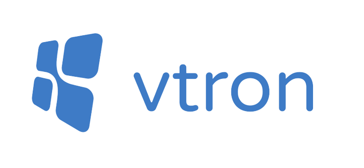
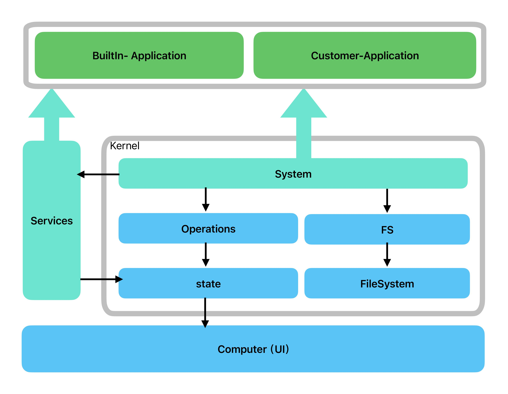

<!--
 * @Author: Royal
 * @LastEditTime: 2022-04-26 15:08:12
 * @Description:
 * @FilePath: /myindex/README.md
-->

<p align="center"><a href="https://vtron.site" target="_blank" rel="noopener noreferrer"></a></p>

<div align="center">

vtron, 基于Vue3的 Win10 UI 框架

</div>

<div align="center">

<a href="https://vtron.site/doc" target="_blank">文档</a>|<a href="https://vtron.site/doc" target="_blank">官网</a>|<a href="http://vtron.site/win/" target="_blank">样例</a>

</div>

<span style="color:#999;text-align:center">推荐 Vue 3 + Typescript + Vite
</span>

[English](./README_EN.md) | 中文

本框架可以让你的页面像win10视窗系统一样，运行一个网页上的win10系统。

#### 优势：

文件系统：可以上传文件预览显示编辑。长时间保存。

终端系统：终端控制文件。

js执行：保存的js文件可以执行。

软件商店：下载的软件可以长时间保存。

开发时插件机制，控制system的状态。

qq群：712921211


## 最新更新日志

更新demo项目的主页，浏览器，以及添加flac音乐播放器


## 提交应用

如果您开发了基于vtron的应用，或能用在vtron中，请在issue中贴上仓库链接或代码

## 开发流程

### 使用 Github 模版

1. 创建项目
   https://github.com/royalknight56/vtron-template

从这个模版仓库创建新的项目。

2. clone 项目

git clone 已经创建好的项目

3. 修改 apps 目录下的文件，或者新建 app

### 使用 npm，从创建好的 vue 项目开始

1. 安装 vtron

> npm install vtron

2. 在 vue 中 引入样式文件

引入样式文件"vtron/distlib/style.css"

```js
import 'vtron/distlib/style.css';
```

main.ts 结果

```js
import { createApp } from 'vue';
import App from './App.vue';
import 'vtron/distlib/style.css';

createApp(App).mount('#app');
```

  注意⚠️：0.7版本不需要再use Vtron插件


3. 在页面中引入`VtronComputer`组件和创建`System`实例

我们需要创建一个 `System` 实例，这个实例管理着系统的所有状态信息。

并且需要在vue组件模版中写入`VtronComputer`组件

将new出来的`System`实例传入到`VtronComputer`组件的`system`参数中

```vue
// App.vue
<template>
  <div class="outer">
    <VtronComputer :system="system"></VtronComputer>
  </div>
</template>
<script setup>
import { System，VtronComputer} from 'vtron';
let system = new System();
</script>
```

此步骤之后，run dev 已经可以看到 win10 启动了

4. 控制屏幕 🖥 大小

在组件外围包裹一个 outer

```vue
<template>
  <div class="outer">
    <VtronComputer :system="system"></VtronComputer>
  </div>
</template>
```

定义 outer 样式

```html
<style scoped>
  .outer {
    width: 100vw;
    height: 100vh;
  }
</style>
```

这样就是占据全部页面显示

4. 在 apps 文件夹下新建 vue 文件，主要在此文件夹中编写窗口内容

也可以在其他文件夹下，

这次，我们创建一个`Hello.vue`文件，

```vue
// Hello.vue
<template>
  <div class="app">
    <h1>HelloWorld</h1>
  </div>
</template>
```

5. 在 system 中注册 app

在 system 的构造函数传入配置项，

其中 desktop 是桌面的配置项，可以配置多个 app

配置之后，软件的图标，快捷方式会显示在桌面上

> 注意!

> 需要点击开始菜单中的电源按钮，再点击恢复，才能看到 app

注册之后，需要点击开始菜单中的电源按钮，再点击恢复，才能看到 app

这样是为了使得系统重回第一次启动的状态，这样 vtron 才会在桌面重新添加图标

```vue
<script setup>
import { System } from 'vtron';
import HelloVue from './apps/Hello.vue';
import someicon from './assets/someicon.png';
let system = new System({
  desktop: [
    {
      name: 'HelloVue',
      icon: someicon,
      window: {
        content: HelloVue,
        icon: someicon,
      },
    },
  ],
});
</script>
```

### 窗口中的操作

下面是包含了部分api操作的示例

```vue
<template>
  <div class="outer">
    {{ sys?.version }}
  </div>
</template>
<script lang="ts" setup>
import { Notify, BrowserWindow, System } from 'vtron';
import { inject, onMounted, ref, onUnmounted } from 'vue';
// 通过inject获取到窗口所在的系统的信息
const system = inject<System>('system')!;
/**
 * 有两种在窗口中使用system的方法，一种是通过inject注入，一种是直接引入system的实例
 * const system = new System();
 * export {
 *  system
 * }
 * 
 * 这样就可以在窗口中直接使用system的实例
 * import { system } from './system';
 * 
 */

// 通过inject导入本窗口的信息
const browserWindow: BrowserWindow = inject('browserWindow') as BrowserWindow;

// 获取本地保存的md文件
system.fs.readFile('/C/User/Note/test.md').then((res) => {
  console.log(res);
});

// 监听窗口的部分事件
browserWindow.on('move', (...arg: any) => {
  console.log('move', arg);
});
browserWindow.on('resize', (...arg: any) => {
  console.log('resize', arg);
});
browserWindow.on('state', (...arg: any) => {
  console.log('state', arg);
});

function nextStep(fun: () => void, time?: number) {
  return new Promise((resolve) => {
    const res = fun();
    setTimeout(() => {
      resolve(res);
    }, time || 50);
  });
}
await nextStep(() => {
  // 获取窗口的位置大小
  const [x, y] = browserWindow.getPosition();
  const [width, height] = browserWindow.getSize();
  // 调用系统提示,创建之后，会在屏幕右下角显示消息通知
  new Notify({
    title: 'title',
    content: `${x},${y},${width},${height}`,
    timeout: 5000,
  });
}, 100);
await nextStep(() => {
  // 设置窗口的位置大小
  browserWindow.setPosition(100, 100);
  browserWindow.setSize(500, 500);
}, 100);

await nextStep(() => {
  // 将窗口居中
  browserWindow.center();
}, 100);

await nextStep(() => {
  const title = browserWindow.getTitle();
  // 设置窗口的标题
  browserWindow.setTitle('新标题');
}, 100);
await nextStep(() => {
  // 窗口最大化
  browserWindow.maximize();
}, 200);
await nextStep(() => {
  // 恢复窗口状态
  browserWindow.restore();
}, 100);
await nextStep(() => {
  // 窗口最小化
  browserWindow.minimize();
}, 200);
await nextStep(() => {
  // 恢复窗口状态
  browserWindow.restore();
}, 100);

await nextStep(() => {
  // 设置窗口全屏
  browserWindow.setFullScreen(true);
}, 100);
await nextStep(() => {
  browserWindow.setFullScreen(false);
}, 100);

</script>
```

### 创建一个窗口

在一个应用中，可以使用`BrowserWindow`类创建一个窗口

```vue
<template>
  <div class="outer">
    <button @click="createWindow">创建窗口</button>
  </div>
</template>
<script lang="ts" setup>
import { BrowserWindow } from 'vtron';
import { ref } from 'vue';
const createWindow = () => {
  const win = new BrowserWindow();
  win.show();
};
</script>
```
通过实例化`BrowserWindow`类，可以创建一个窗口，然后通过`show`方法显示出来

还有另一种方法，通过system的`createWindow`方法创建窗口

```vue
<template>
  <div class="outer">
    <button @click="createWindow">创建窗口</button>
  </div>
</template>
<script lang="ts" setup>
import { system } from './system';
import { ref } from 'vue';
const createWindow = () => {
  const win = system.createWindow({
    content: ///....,
    title: 'Hello',
  });
  win.show();
};
</script>
```

这两种方法有细微的区别，`system.createWindow`创建的窗口，是在当前系统中创建的窗口，

而`BrowserWindow`创建的窗口是没有指定`system`的，之所以会在当前`system`显示出来窗口，是因为`BrowserWindow`类默认是当前的`system`。

可以通过`BrowserWindow.system` 查看到当前`BrowserWindow`的默认`system`，一般是最后创建的`system`实例。

当我们创建多个`system`的时候，就必须使用`system.createWindow`来创建窗口了。


## 常见问题

为什么在 system 中添加了 app，桌面还是没有显示出 app

桌面的图标都是在用户的文件系统中保存的

Vtron 只有在系统第一次启动的时候，才会在文件系统中添加 app 图标

所以，这时需要点击开始菜单->电源->恢复

恢复之后，系统会回到第一次启动的状态，这时，会执行一些特殊的过程，比如在桌面添加 app 图标

## 调试和贡献流程

欢迎任何更改，pr

系统架构：



### 项目结构

项目是monorepo项目，

包含多个子项目，存在于packages下，每个文件夹是一个子项目。

vtron: 核心项目，包含核心逻辑，vtron核心包。

vtron-demo: demo项目，也是线上vtron.site/win的项目。

vtron-e2e: e2e测试监控项目。

vtron-md: 文档项目，指线上[vtron.site/doc/](https://vtron.site/doc/)

vtron-plus: plus插件，包含了部分占用体积的附加功能。

vtron-store: 应用商店，线上应用商店打开时的内嵌网页，可以与vtron框架交互，提供应用安装功能。

### 启动项目

首先安装所有依赖，建议使用pnpm。

```bash
pnpm i
```

安装依赖之后，启动对应子项目，

对于vtron 项目，运行：

```bash
pnpm vtron dev
```

对于plus项目，运行：

```bash
pnpm vtron build
pnpm plus dev
```

对于demo项目，运行：

```bash
pnpm vtron build
pnpm plus build
pnpm demo dev
```

对于md项目，运行：

```bash
pnpm md dev
```

对于shop项目，运行：

```bash
pnpm shop dev
```

对于e2e项目，运行：

```bash
pnpm e2e dev
```

# 感谢Star

欢迎PR，意见，想法，感谢各位大佬的支持


# 需要的帮助

我们需要帮助：

目前需要帮助的方向：

文档建设

更加完善的功能：向更加完善的webOS迈进

碎碎念：参见 Next.md

## 欢迎加入技术交流群
技术交流 & 问题解答 & 项目合作 & 软件服务
<div>

</div>

## Thanks

## Star History

[](https://star-history.com/#royalknight56/vtron&Date)


